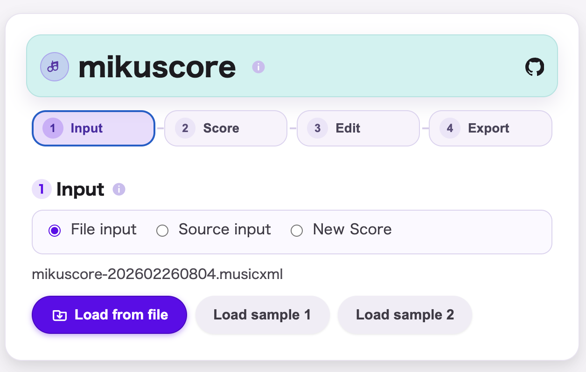
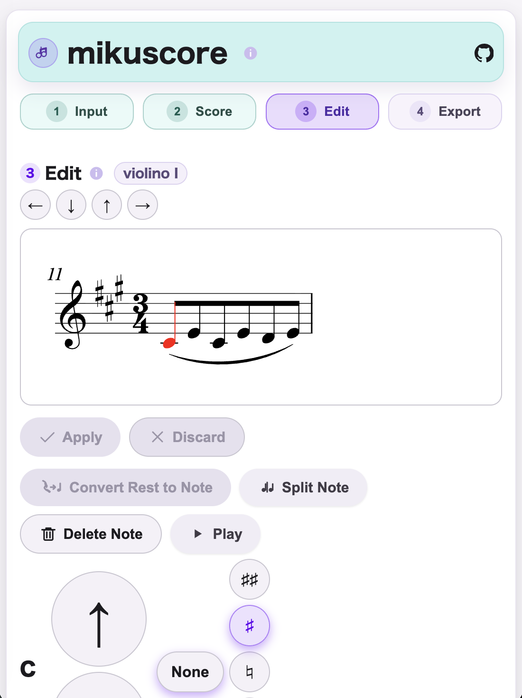

# mikuscore

## English
mikuscore is a browser-based score editor for importing and exporting MusicXML, MuseScore, MIDI, VSQX, ABC, MEI, and LilyPond, with notation preview and note editing.

- Designed to preserve existing MusicXML as much as possible.
- Works offline in a single HTML distribution.
- Smartphone-centered workflows, with PC use also supported.
- ABC, MEI, and LilyPond support is currently experimental.

Its primary goal is reliability, not feature volume: edit while preserving existing MusicXML as much as possible.

### Product Positioning
- Focus on the following two smartphone-centered workflows (PC use is also supported):
  - Quick and easy entry for simple scores on a smartphone.
  - Execute part of a large score workflow (prepared on PC) on a smartphone.
- Keep an intentionally small feature set and optimize for mobile usability and editing speed.
- Use MusicXML as the core data structure and avoid unnecessary transformations.

### Core Principles
- Prioritize preserving existing MusicXML with minimal patch editing.
- Preserve unknown/unsupported elements.
- Preserve `<backup>`, `<forward>`, and existing `<beam>` nodes.
- Roll back atomically on failure.
- Keep Core/UI separated so UI can be replaced later.
- Keep smartphone-centered workflows practical, with PC use also supported.

### MVP Highlights
- If `dirty === false`, save returns original XML text (`original_noop`).
- Overfull measures are rejected with `MEASURE_OVERFULL`.
- Commands must target the same voice as the selected note; mismatches are rejected with `MVP_UNSUPPORTED_NON_EDITABLE_VOICE`.
- MVP commands: `change_to_pitch`, `change_duration`, `insert_note_after`, `delete_note`, `split_note`.
- Rests are not a normal edit target, but rest-to-note via `change_to_pitch` is allowed.
- Serialization is compact (no pretty-print).

### Supported MusicXML Version
- **MusicXML 4.0**

### Format Support Note
- `utaformatix3-ts-plus` is bundled as a vendored integration (`src/vendor/utaformatix3/utaformatix3-ts-plus.mikuscore.iife.js`) for VSQX <-> MusicXML conversion.
- We sincerely appreciate the UtaFormatix / utaformatix3 ecosystem and contributors for making this VSQX interoperability possible.
- MEI support is currently experimental.
- LilyPond (`.ly`) support is currently experimental.

### Distribution and Development
- Distribution: **single-file web app** (`mikuscore.html`).
- Runtime: offline, no external network dependency.
- Source: split TypeScript files.
- Build: `mikuscore-src.html` + `src/` -> `mikuscore.html`.

### Development Commands
- `npm run build`
- `npm run check:all`
- `npm run clean`
- `npm run typecheck`
- `npm run test:unit`
- `npm run test:property`
- `npm run test:all`
- `npm run build:vendor:utaformatix3` (sync vendored `utaformatix3-ts-plus` JS/doc from upstream)

### Documents
- `docs/spec/SPEC.md`
- `docs/spec/TERMS.md`
- `docs/spec/COMMANDS.md`
- `docs/spec/COMMAND_CATALOG.md`
- `docs/spec/DIAGNOSTICS.md`
- `docs/spec/MIDI_IO.md`
- `docs/spec/PLAYBACK.md`
- `docs/spec/ABC_IO.md`
- `docs/spec/TEST_MATRIX.md`
- `docs/spec/LOCAL_WORKFLOW.md`
- `docs/spec/BUILD_PROCESS.md`
- `docs/spec/ARCHITECTURE.md`
- `docs/spec/UI_SPEC.md`
- `docs/spec/SCREEN_SPEC.md`
- `TODO.md`

Debugging note:
- For import-side incident analysis, check `docs/spec/MIDI_IO.md` and `docs/spec/ABC_IO.md` sections about `attributes > miscellaneous > miscellaneous-field` (`mks:*` debug fields).

### Screenshots

---

## 日本語
mikuscore は、MusicXML、MuseScore、MIDI、VSQX、ABC、MEI、LilyPond の入出力に対応し、譜面プレビューとノート編集をブラウザ上で行うスコアエディタです。

- 既存 MusicXML を極力壊さない編集を重視しています。
- 単一 HTML 配布でオフライン動作します。
- スマホ中心のワークフローを重視しつつ、PC利用にも対応します。
- ABC、MEI、LilyPond 対応は現在 Experimental（試験対応）です。

このアプリの主眼は「多機能化」ではなく、極力既存 MusicXML を壊さずに編集する信頼性です。

### プロダクトの位置づけ
- 利用シーンは次の2つを中心に据えます（スマホ中心ですが、PC利用も可能です）。
  - 簡単な譜面入力をスマホ上で手軽に行う。
  - PCで進めている大規模な譜面作業の一部を切り出し、スマホで一部実施する。
- 機能は意図的に絞り、スマホ上での使いやすさと入力スピードを優先します。
- MusicXML を基軸データ構造として扱い、不要な変換を避けます。

### 基本方針
- 既存 MusicXML の保全を最優先に最小パッチ編集を実現。
- unknown / unsupported 要素を保持。
- `<backup>` / `<forward>` / 既存 `<beam>` を保持。
- 失敗時は原子的にロールバック。
- 将来の UI 置換を考慮した Core / UI 分離設計。
- スマートフォンをサポート。

### MVP 仕様ハイライト
- `dirty === false` の保存は入力 XML をそのまま返す（`original_noop`）。
- 小節 overfull は `MEASURE_OVERFULL` で拒否。
- コマンド voice と対象ノート voice が不一致の場合は `MVP_UNSUPPORTED_NON_EDITABLE_VOICE` で拒否。
- `change_to_pitch` / `change_duration` / `insert_note_after` / `delete_note` / `split_note` をMVPコマンドとして扱う。
- 休符は通常の編集対象外だが、`change_to_pitch` による休符音符化は許可。
- pretty-print なしでシリアライズ。

### 対応 MusicXML バージョン
- **MusicXML 4.0**

### フォーマット対応メモ
- VSQX <-> MusicXML 変換のため、`utaformatix3-ts-plus` を同梱連携しています（`src/vendor/utaformatix3/utaformatix3-ts-plus.mikuscore.iife.js`）。
- VSQX 相互運用を実現する基盤を築いてくださった UtaFormatix / utaformatix3 のエコシステムと貢献者の皆さまに、深く感謝します。
- MEI 対応は現在 Experimental（試験対応）です。
- LilyPond（`.ly`）対応は現在 Experimental（試験対応）です。

### 配布と開発方針
- 配布形態: 単一 HTML（`mikuscore.html`）。
- 実行条件: オフライン動作、外部依存なし。
- 開発形態: 分割 TypeScript ソース。
- ビルド方針: `mikuscore-src.html` + `src/` から `mikuscore.html` を生成。

### 開発コマンド
- `npm run build`
- `npm run check:all`
- `npm run clean`
- `npm run typecheck`
- `npm run test:unit`
- `npm run test:property`
- `npm run test:all`
- `npm run build:vendor:utaformatix3`（upstream から `utaformatix3-ts-plus` の同梱JS/ドキュメントを同期）

### ドキュメント
- `docs/spec/SPEC.md`
- `docs/spec/TERMS.md`
- `docs/spec/COMMANDS.md`
- `docs/spec/COMMAND_CATALOG.md`
- `docs/spec/DIAGNOSTICS.md`
- `docs/spec/MIDI_IO.md`
- `docs/spec/PLAYBACK.md`
- `docs/spec/ABC_IO.md`
- `docs/spec/TEST_MATRIX.md`
- `docs/spec/LOCAL_WORKFLOW.md`
- `docs/spec/BUILD_PROCESS.md`
- `docs/spec/ARCHITECTURE.md`
- `docs/spec/UI_SPEC.md`
- `docs/spec/SCREEN_SPEC.md`
- `TODO.md`

デバッグメモ:
- インポート時の事象解析は `docs/spec/MIDI_IO.md` と `docs/spec/ABC_IO.md` の `attributes > miscellaneous > miscellaneous-field`（`mks:*` デバッグ項目）を参照してください。

### スクリーンショット

