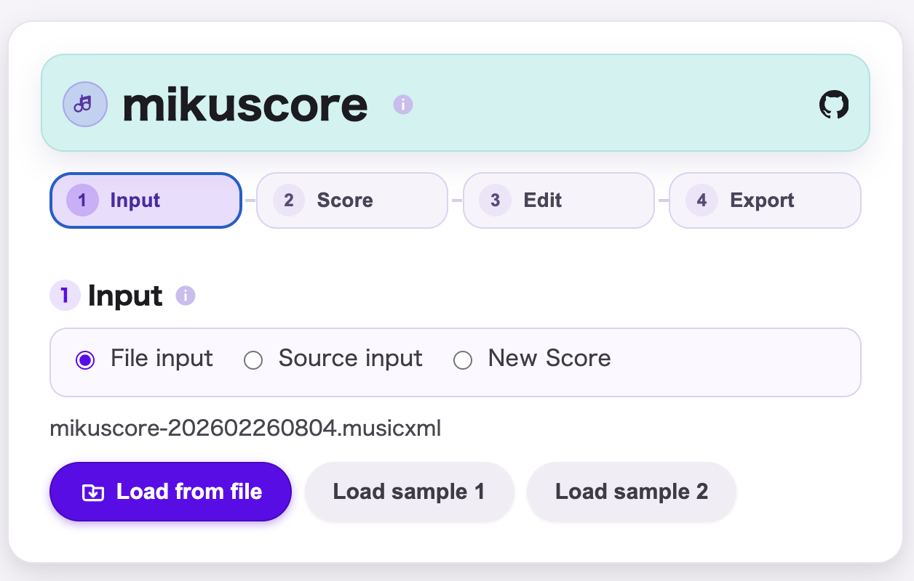
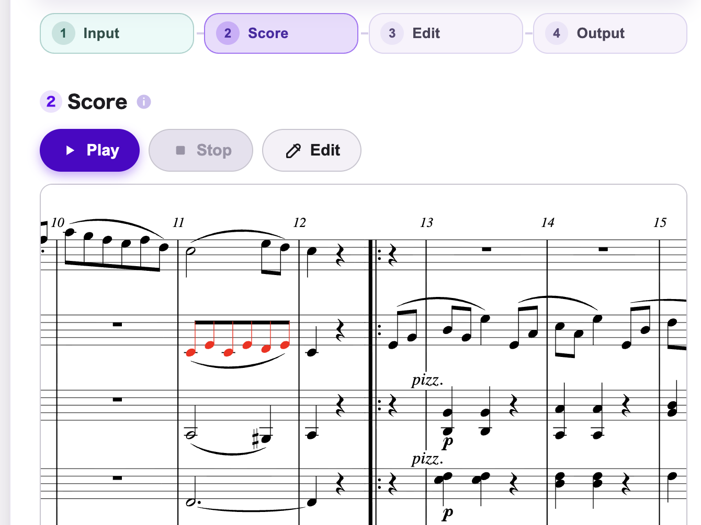

# mikuscore

## Language Policy
- English text is the normative source unless explicitly noted otherwise.
- Japanese sections are abridged translations for readability.
- Exception: for undecided points or in-progress notes, Japanese-only entries MAY be used temporarily.

## English
mikuscore is a browser-based **score format converter** centered on MusicXML.
It is delivered as a **single-file web app** (`mikuscore.html`) and runs offline.

### Screenshots

### What makes mikuscore different
- MusicXML-first conversion pipeline
- Preserve existing MusicXML as much as possible
- Keep conversion losses visible via diagnostics / metadata
- No installation required (single HTML, browser only)

### Scope
- Primary: format conversion and round-trip stability
- Secondary: lightweight notation editing and preview
- Not a feature-complete score engraving editor

### Supported formats
- MusicXML (`.musicxml` / `.xml` / `.mxl`) (MusicXML 4.0 core baseline)
- MuseScore (`.mscx` / `.mscz`)
- MIDI (`.mid` / `.midi`)
- VSQX (`.vsqx`) (via vendored `utaformatix3-ts-plus`)
- ABC (`.abc`) (experimental)
- MEI (`.mei`) (experimental)
- LilyPond (`.ly`) (experimental)

### Build and local development
- `npm run build`
- `npm run check:all`
- `npm run clean`
- `npm run typecheck`
- `npm run test:unit`
- `npm run test:property`
- `npm run test:all`
- `npm run build:vendor:utaformatix3`

### Documentation map
- Product docs (positioning / policy / coverage / quality):
  - `docs/PRODUCT_POSITIONING.md`
  - `docs/CONVERSION_PRINCIPLES.md`
  - `docs/FORMAT_COVERAGE.md`
  - `docs/QUALITY.md`
- Specification docs (`docs/spec/*`) are normative implementation specs:
  - `docs/spec/SPEC.md`
  - `docs/spec/ARCHITECTURE.md`
  - `docs/spec/DIAGNOSTICS.md`
  - `docs/spec/MUSESCORE_IO.md`
  - `docs/spec/MIDI_IO.md`
  - `docs/spec/ABC_IO.md`
  - `docs/spec/TEST_MATRIX.md`
  - `docs/spec/AI_JSON_SPEC.md` (currently experimental, but this English document is the current source for the AI-facing JSON projection / patch contract)

Debugging note:
- For import-side incident analysis, check `docs/spec/MIDI_IO.md` and `docs/spec/ABC_IO.md` sections about `attributes > miscellaneous > miscellaneous-field` (`mks:*` debug fields).

---

## 日本語
mikuscore は、MusicXML を中核に据えた **譜面フォーマット変換ソフト** です。  
配布形態は **単一 HTML**（`mikuscore.html`）で、ブラウザのみでオフライン動作します。

### スクリーンショット

### mikuscore の特徴
- MusicXML-first の変換パイプライン
- 既存 MusicXML を極力壊さない
- 変換で生じた欠落を診断情報・メタデータで追跡可能
- インストール不要（単一 HTML、ブラウザのみ）

### スコープ
- 主機能: フォーマット変換と round-trip 安定性
- 副機能: 軽量な譜面編集とプレビュー
- 多機能な浄書エディタの代替を目指すものではない

### 対応フォーマット
- MusicXML（`.musicxml` / `.xml` / `.mxl`）（MusicXML 4.0 基準フォーマット）
- MuseScore（`.mscx` / `.mscz`）
- MIDI（`.mid` / `.midi`）
- VSQX（`.vsqx`）（同梱 `utaformatix3-ts-plus` 経由）
- ABC（`.abc`）（実験的対応）
- MEI（`.mei`）（実験的対応）
- LilyPond（`.ly`）（実験的対応）

### ビルドとローカル開発
- `npm run build`
- `npm run check:all`
- `npm run clean`
- `npm run typecheck`
- `npm run test:unit`
- `npm run test:property`
- `npm run test:all`
- `npm run build:vendor:utaformatix3`

### ドキュメントマップ
- プロダクト文書（位置づけ / 方針 / 対応範囲 / 品質方針）:
  - `docs/PRODUCT_POSITIONING.md`
  - `docs/CONVERSION_PRINCIPLES.md`
  - `docs/FORMAT_COVERAGE.md`
  - `docs/QUALITY.md`
- 仕様文書（`docs/spec/*`）は実装規範:
  - `docs/spec/SPEC.md`
  - `docs/spec/ARCHITECTURE.md`
  - `docs/spec/DIAGNOSTICS.md`
  - `docs/spec/MUSESCORE_IO.md`
  - `docs/spec/MIDI_IO.md`
  - `docs/spec/ABC_IO.md`
  - `docs/spec/TEST_MATRIX.md`
  - `docs/spec/AI_JSON_SPEC.md`（現在は実験的だが、生成AI向け JSON projection / patch 契約の現行正本はこの英語文書）

デバッグメモ:
- インポート時の事象解析は `docs/spec/MIDI_IO.md` と `docs/spec/ABC_IO.md` の `attributes > miscellaneous > miscellaneous-field`（`mks:*` デバッグ項目）を参照してください。
